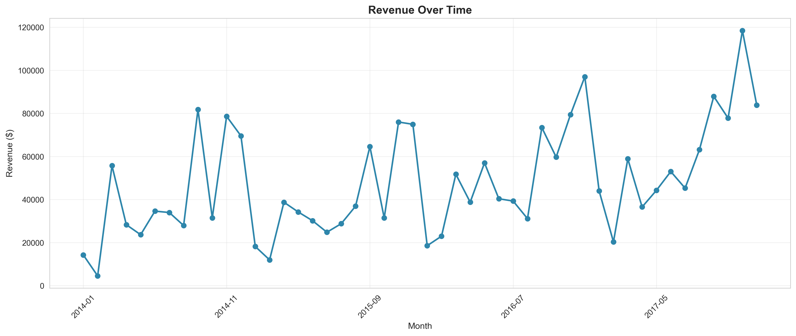
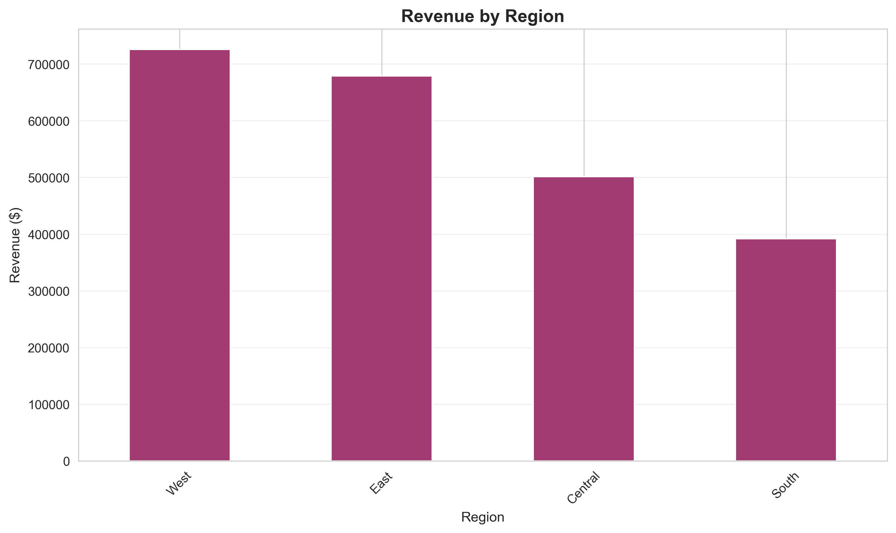
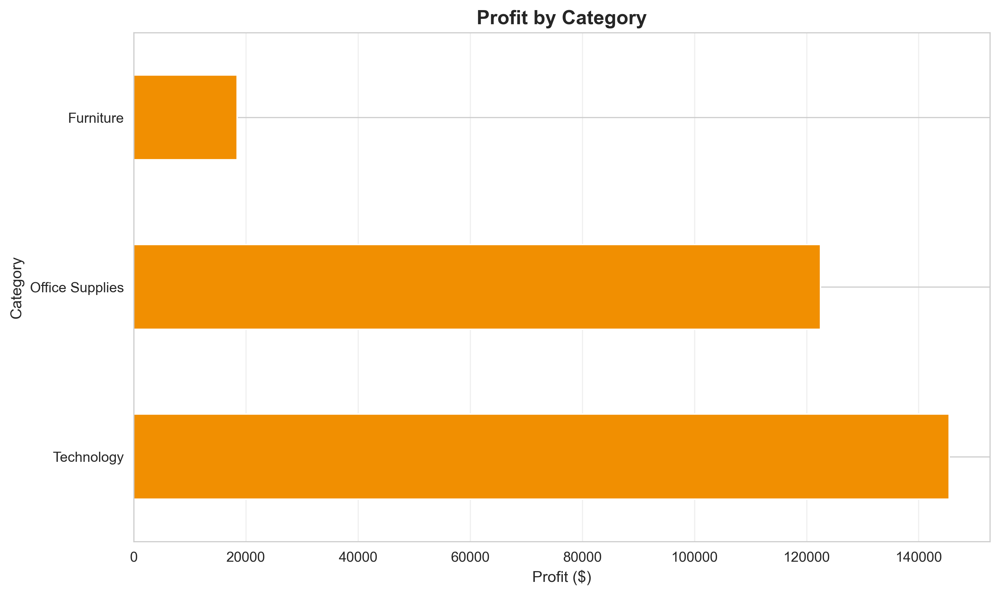
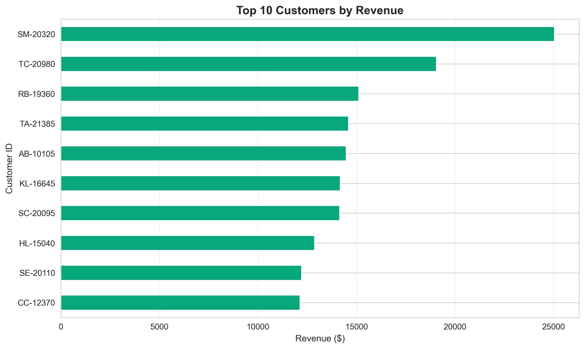

# E-Commerce Sales Analysis

Professional data analytics portfolio project analyzing 9,994 sales transactions across multiple regions and product categories.

## Visualizations









## Key Metrics

- **Total Revenue**: $2,297,201
- **Total Profit**: $286,397 (12.47% margin)
- **Customers**: 793 unique accounts
- **Orders Analyzed**: 9,994 transactions

## Technologies

Python (Pandas, NumPy, Matplotlib, Seaborn) | SQL | Git | Power BI ready

## 5 Key Insights

1. **Regional Performance**: West region drives 31.5% of revenue ($725K). Central/South regions are underdeveloped expansion opportunities.

2. **VIP Customers**: Top 20 customers generate $250K+ revenue. Customer SM-20320 alone contributes $25K (11% of top 20).

3. **Category Mix**: Technology (51% profit, 17.4% margin) outperforms Furniture (2.5% margin). Furniture requires pricing review.

4. **Seasonal Patterns**: November peaks at $118K revenue. Q1 averages $45K. 150% variance suggests inventory optimization opportunity.

5. **Discount Impact**: Heavy discounting erodes margins. Over 20% discounts average only 0.5% profit margin vs 15%+ for no-discount orders.

## Project Structure

```
E-Commerce_Sales_Analysis/
├── data/
│   ├── superstore.csv              # Raw data
│   └── superstore_cleaned.csv       # Processed
├── scripts/
│   ├── superstore_analysis.py       # Main pipeline
│   └── data_cleaning.py             # Data prep module
├── sql/
│   └── queries.sql                  # 12 production queries
├── outputs/charts/                  # 4 visualizations (300 DPI)
└── README.md
```

## Quick Start

```bash
# 1. Clone
git clone https://github.com/BogdanMygovych/E-Commerce-Sales-Analysis.git
cd E-Commerce-Sales-Analysis

# 2. Setup
python3 -m venv venv
source venv/bin/activate

# 3. Install & run
pip install -r requirements.txt
python scripts/superstore_analysis.py
```


